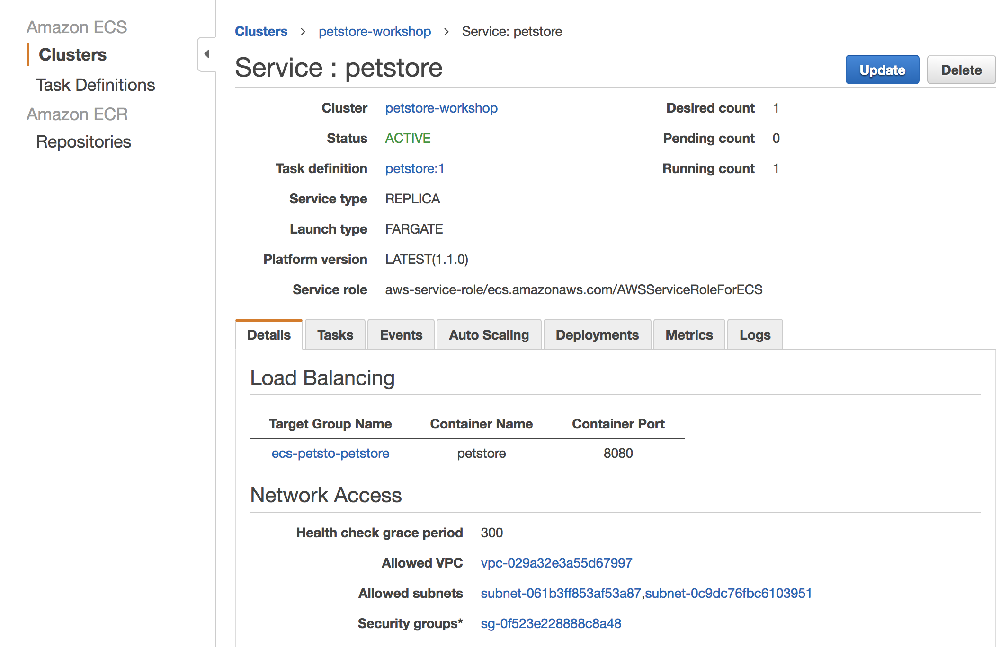
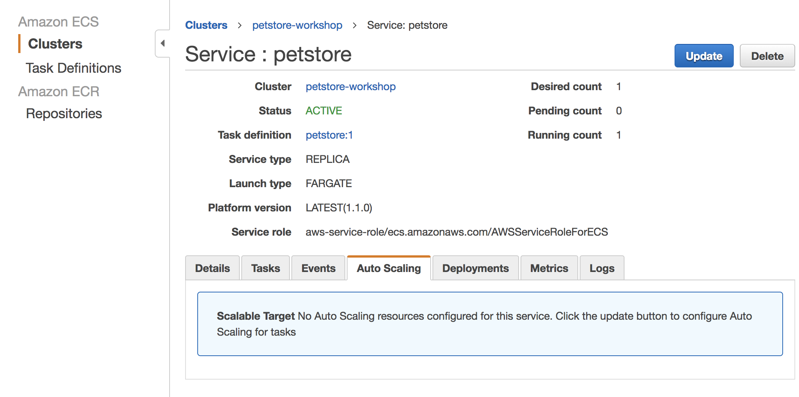
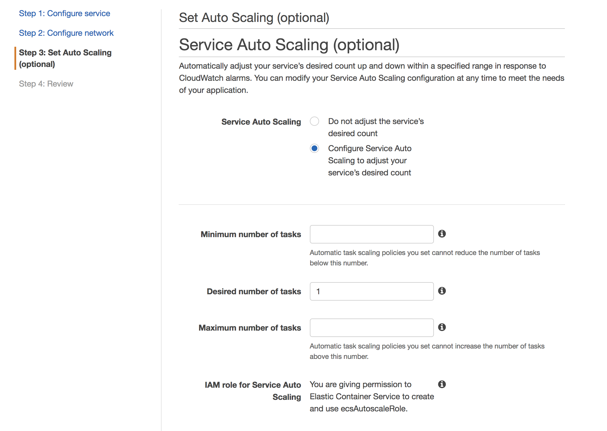

+++
title = "Container Elasticity"
chapter = false
weight = 1
+++

## Container Elasticity

### Expected Outcome:
* 300 level differentiation ECS/Fargate Vs EKS Scaling Patterns

**Lab Requirements:**
* an Amazon Elastic Container Service Cluster
* an Amazon Elastic Container Service for Kubernetes Cluster

**Average Lab Time:** 20-30 minutes

### Introduction
In this module we will take the existing applications you've deployed into your
Amazon Fargate cluster and your Amazon EKS cluster and demonstrate some of the
scaling capabilities.

#### Amazon Fargate AutoScaling
To scale a Fargate task you will need to configure this via the console, or via
the CLI. For this example we're going to go through the Console.

1. Navigate to the Petstores Services console within the [AWS ECS Console](https://console.aws.amazon.com/ecs/home#/clusters/petstore-workshop/services/petstore/details)


2. From this screen click on the *Auto Scaling* tab in the Services panel. Where
   you will see a note for "*Scalable Target* No Auto Scaling resources
   configured for this service. Click the update button to configure Auto
   Scaling for tasks".


3. Now we can click *Update* as the note says to configure our Auto Scaling.

NOTE: The petstore app in it's current configuration on Fargate isn't actually
auto scalable. Each replica that is created will have a new Postrges container
deployed along side it without shared storage. *This is for demonstration
purposes only.*

4. We'll then leave all the settings the same on *Configure service* page and
   click *Next step*

5. Again leaving the settings the same on *Configure network* and clicking *Next
   step*
6. Now on the *Set Auto Scaling (optional)* page we can select the option
   *Configure Service Auto Scaling to adjust your service’s desired count* This
   will open up the following panel allowing us to set our auto scaling rules.


7. We'll fill this out with demo information set *Minimum number of tasks* to
   `1` set *Desired number of tasks* to `1` and set *Maximum number of tasks* to
   `5` allowing Fargate to consume upto 5 running tasks when the app needs to
   auto scale and stops after that.

8. We'll then *Add scaling policy* which will open up a panel for us to add an
   Auto Scaling Policy.

9. In this form select *Target tracking* set the *Policy name** to
   `PetstoreFrontendAutoscalingPolicy` configure which *ECS service metric** to
   scale based on and then add a *Target value* of `75` which will tell it to
   scale when the container gets to 75% of whatever metric you are using.

10. When you are done *Save* that and it will close the panel and you will be
    able to select *Next step* continuing to *Update Service* which will apply
    all of your changes.

This is how easy it is to configure your Auto Scaling policies for an Amazon ECS
and Amazon Fargate Cluster.


#### Amazon EKS AutoScaling

Within a Kubernetes cluster there are multiple ways to think about scaling your
applications. 1. is to scale the instances running the cluster, this is
typically called Cluster AutoScaling. 2. Pod AutoScaling typically
referred to as Horizontal Pod AutoScaling or (HPA) for short. Both Cluster
AutoScaling and Horizontal Pod Autoscaling provide different mechanisms to scale
your entire architecture via any way.

##### Cluster AutoScaling

Cluster autoscaling deals with how many physical EC2 instances are running in
the cluster and how many resource requests are in the scheduler. How this works,
in your `Deployment` you can define CPU and Memory requests and limits; when you
scale this number it adds up all the request and verifies it has the capacity to
fulfill all the requests. When you run Cluster Autoscaler it will listen to the
scheduler and when it doesn't have enough resources it will reconfigure the
desired instance count on the AWS AutoScaling Group causing it to provision more
instances to fulfill the request.

Lets deploy Cluster Autoscaler to your EKS cluster.

1. Switch to the tab where you have your Cloud9 environment opened and change to this modules directory by running:
```
cd ~/environment/aws-modernization-workshop/modules/containerize-elasticity
```

2. Get the autoscaling group name of for the worker nodes, to do this run this
   command from your Cloud9 terminal session.
```
aws autoscaling describe-auto-scaling-groups | jq -r '.AutoScalingGroups[] | select((.Tags[].Value == "owned") and (.Tags[].Key == "kubernetes.io/cluster/petstore")) .AutoScalingGroupName'
```
```
EKS-petstore-DefaultNodeGroup-NodeGroup-EFK80OCC50R
```

3. Open the *cluster-autoscaler.yaml* file by double clicking the
   filename in the lefthand navigation in Cloud9.

4. The file has the following contents:
*.cluster-autoscaler.yaml*

```
---
apiVersion: v1
kind: ServiceAccount
metadata:
  labels:
    k8s-addon: cluster-autoscaler.addons.k8s.io
    k8s-app: cluster-autoscaler
  name: cluster-autoscaler
  namespace: kube-system
---
apiVersion: rbac.authorization.k8s.io/v1beta1
kind: ClusterRole
metadata:
  name: cluster-autoscaler
  labels:
    k8s-addon: cluster-autoscaler.addons.k8s.io
    k8s-app: cluster-autoscaler
rules:
- apiGroups: [""]
  resources: ["events","endpoints"]
  verbs: ["create", "patch"]
- apiGroups: [""]
  resources: ["pods/eviction"]
  verbs: ["create"]
- apiGroups: [""]
  resources: ["pods/status"]
  verbs: ["update"]
- apiGroups: [""]
  resources: ["endpoints"]
  resourceNames: ["cluster-autoscaler"]
  verbs: ["get","update"]
- apiGroups: [""]
  resources: ["nodes"]
  verbs: ["watch","list","get","update"]
- apiGroups: [""]
  resources: ["pods","services","replicationcontrollers","persistentvolumeclaims","persistentvolumes"]
  verbs: ["watch","list","get"]
- apiGroups: ["extensions"]
  resources: ["replicasets","daemonsets"]
  verbs: ["watch","list","get"]
- apiGroups: ["policy"]
  resources: ["poddisruptionbudgets"]
  verbs: ["watch","list"]
- apiGroups: ["apps"]
  resources: ["statefulsets"]
  verbs: ["watch","list","get"]
- apiGroups: ["storage.k8s.io"]
  resources: ["storageclasses"]
  verbs: ["watch","list","get"]

---
apiVersion: rbac.authorization.k8s.io/v1beta1
kind: Role
metadata:
  name: cluster-autoscaler
  namespace: kube-system
  labels:
    k8s-addon: cluster-autoscaler.addons.k8s.io
    k8s-app: cluster-autoscaler
rules:
- apiGroups: [""]
  resources: ["configmaps"]
  verbs: ["create"]
- apiGroups: [""]
  resources: ["configmaps"]
  resourceNames: ["cluster-autoscaler-status"]
  verbs: ["delete","get","update"]

---
apiVersion: rbac.authorization.k8s.io/v1beta1
kind: ClusterRoleBinding
metadata:
  name: cluster-autoscaler
  labels:
    k8s-addon: cluster-autoscaler.addons.k8s.io
    k8s-app: cluster-autoscaler
roleRef:
  apiGroup: rbac.authorization.k8s.io
  kind: ClusterRole
  name: cluster-autoscaler
subjects:
  - kind: ServiceAccount
    name: cluster-autoscaler
    namespace: kube-system

---
apiVersion: rbac.authorization.k8s.io/v1beta1
kind: RoleBinding
metadata:
  name: cluster-autoscaler
  namespace: kube-system
  labels:
    k8s-addon: cluster-autoscaler.addons.k8s.io
    k8s-app: cluster-autoscaler
roleRef:
  apiGroup: rbac.authorization.k8s.io
  kind: Role
  name: cluster-autoscaler
subjects:
  - kind: ServiceAccount
    name: cluster-autoscaler
    namespace: kube-system

---
apiVersion: extensions/v1beta1
kind: Deployment
metadata:
  name: cluster-autoscaler
  namespace: kube-system
  labels:
    app: cluster-autoscaler
spec:
  replicas: 1
  selector:
    matchLabels:
      app: cluster-autoscaler
  template:
    metadata:
      labels:
        app: cluster-autoscaler
    spec:
      serviceAccountName: cluster-autoscaler
      containers:
        - image: k8s.gcr.io/cluster-autoscaler:v1.2.2
          name: cluster-autoscaler
          resources:
            limits:
              cpu: 100m
              memory: 300Mi
            requests:
              cpu: 100m
              memory: 300Mi
          command:
            - ./cluster-autoscaler
            - --v=4
            - --stderrthreshold=info
            - --cloud-provider=aws
            - --skip-nodes-with-local-storage=false
            - --nodes=2:10:<AutoScalingGroupName>
          env:
            - name: AWS_REGION
              value: <Region>
          volumeMounts:
            - name: ssl-certs
              mountPath:  /etc/kubernetes/pki/ca.crt
              readOnly: true
          imagePullPolicy: "Always"
      volumes:
        - name: ssl-certs
          hostPath:
            path: "/etc/kubernetes/pki/ca.crt"
```

5. Then replace `<Region>` with the region your cluster is deployed into. and
   replace `<AutoScalingGroupName>` with the output from #2

6. Once you have edited those values, save and return to your terminal session
   and run.
```
kubectl apply -f cluster-autoscaler.yaml
```

```
serviceaccount/cluster-autoscaler created
clusterrole.rbac.authorization.k8s.io/cluster-autoscaler created
role.rbac.authorization.k8s.io/cluster-autoscaler created
clusterrolebinding.rbac.authorization.k8s.io/cluster-autoscaler created
rolebinding.rbac.authorization.k8s.io/cluster-autoscaler created
deployment.extensions/cluster-autoscaler created
```

7. Now we need to configure our instance role to allow it to mutate the
   autoscaling group. To do this we need to get our instance role.
```
aws cloudformation describe-stacks --stack-name eksctl-petstore-nodegroup-0 | jq -r ".Stacks[0].Outputs[0].OutputValue"
```

```
EKS-petstore-DefaultNodeGroup-NodeInstanceRole-1SDLKJZN1UE75
```

*Yours will differ slightly.*

8. With the output from the cloudformation stack you can then `put-role-policy`.
   to enable the autoscaler the ability to control the ASG.

The policy we'll be deploying is in
`modules/container-elasticity/ca-policy.jsom`.

*.ca-policy.json*
```
{
    "Version": "2012-10-17",
    "Statement": [
        {
            "Effect": "Allow",
            "Action": [
                "autoscaling:DescribeAutoScalingGroups",
                "autoscaling:DescribeAutoScalingInstances",
                "autoscaling:DescribeLaunchConfigurations",
                "autoscaling:DescribeTags",
                "autoscaling:SetDesiredCapacity",
                "autoscaling:TerminateInstanceInAutoScalingGroup"
            ],
            "Resource": "*"
        }
    ]
}
```

We'll then add this policy to the Instance role.
```
aws iam put-role-policy --policy-name AmazonEKS_CA_Policy \
  --role-name EKS-petstore-DefaultNodeGroup-NodeInstanceRole-1SDLKJZN1UE75 \
  --policy-document file://${PWD}/modules/container-elasticity/ca-policy.json
```

9. Now let's check out the all the pods and see what we have done.
```
kubectl logs -f deploy/cluster-autoscaler --namespace kube-system -f
```

```
I0824 19:47:24.317676       1 leaderelection.go:199] successfully renewed lease kube-system/cluster-autoscaler
I0824 19:47:26.329037       1 leaderelection.go:199] successfully renewed lease kube-system/cluster-autoscaler
I0824 19:47:28.405951       1 leaderelection.go:199] successfully renewed lease kube-system/cluster-autoscaler
I0824 19:47:28.721876       1 static_autoscaler.go:114] Starting main loop
I0824 19:47:28.991982       1 utils.go:456] No pod using affinity / antiaffinity found in cluster, disabling affinity predicate for this loop
I0824 19:47:28.992001       1 static_autoscaler.go:263] Filtering out schedulables
I0824 19:47:28.992085       1 static_autoscaler.go:273] No schedulable pods
I0824 19:47:28.992099       1 static_autoscaler.go:280] No unschedulable pods
I0824 19:47:28.992111       1 static_autoscaler.go:322] Calculating unneeded nodes
I0824 19:47:29.113364       1 scale_down.go:207] Node ip-192-168-118-217.us-west-2.compute.internal - utilization 0.747000
I0824 19:47:29.113386       1 scale_down.go:211] Node ip-192-168-118-217.us-west-2.compute.internal is not suitable for removal - utilization too big (0.747000)
I0824 19:47:29.113395       1 scale_down.go:207] Node ip-192-168-229-57.us-west-2.compute.internal - utilization 0.055000
I0824 19:47:29.113402       1 scale_down.go:207] Node ip-192-168-129-250.us-west-2.compute.internal - utilization 0.823000
I0824 19:47:29.113408       1 scale_down.go:211] Node ip-192-168-129-250.us-west-2.compute.internal is not suitable for removal - utilization too big (0.823000)
I0824 19:47:29.113417       1 scale_down.go:207] Node ip-192-168-170-118.us-west-2.compute.internal - utilization 0.567000
I0824 19:47:29.113423       1 scale_down.go:211] Node ip-192-168-170-118.us-west-2.compute.internal is not suitable for removal - utilization too big (0.567000)
I0824 19:47:29.223632       1 static_autoscaler.go:337] ip-192-168-229-57.us-west-2.compute.internal is unneeded since 2018-08-24 19:47:18.29182836 +0000 UTC duration 10.430029291s
I0824 19:47:29.223668       1 static_autoscaler.go:352] Scale down status: unneededOnly=true lastScaleUpTime=2018-08-24 19:44:18.175190509 +0000 UTC lastScaleDownDeleteTime=2018-08-24 19:37:17.283607196 +0000 UTC lastScaleDownFailTime=2018-08-24 19:37:17.283607245 +0000 UTC schedulablePodsPresent=false isDeleteInProgress=false
```
*Your output will differ*

In the logs here you can see that it is constantly checkin the amount of nodes
and capactiy each node has available, if we have too many requests for resources
and not enough availabe it will provision new nodes for you. Let's try this.

10. First we need to scale our `deployment` using the `scale` subcommand for
    `kubectl`
```
kubectl scale deploy/frontend --namespace petstore --replicas=10
```

```
deployment.extensions/frontend scaled
```

11. Now we should again log the `cluster-autoscaler` pod and you will see it
    update the `desired` count of instances to reflect that.
```
kubectl logs -f deploy/cluster-autoscaler --namespace kube-system -f
```

In the logs for this you will see the new nodes being provisioned into the
cluster.

12. Now that you have seen this application scale up we can scale this down, but
    prior to scale down we need to disable scale down on the node running
    `cluster-autoscaler` so that it doesn't fail.
```
kubectl annotate node \
  $(kubectl get pod -n kube-system -o jsonpath="{.items[0].spec.nodeName}" -l app=cluster-autoscaler) \
  cluster-autoscaler.kubernetes.io/scale-down-disabled=true
```

```
```

To see this applied you can get the `node` `annotations` using the following.
```
kubectl get node $(kubectl get pod -n kube-system -o jsonpath="{.items[0].spec.nodeName}" -l app=cluster-autoscaler) -o jsonpath="{.metadata.annotations}"
```

```
map[cluster-autoscaler.kubernetes.io/scale-down-disabled:true node.alpha.kubernetes.io/ttl:0 volumes.kubernetes.io/controller-managed-attach-detach:true]
```

13. Now that we have the instance cordoned from `down scaling` we can then `scale` the `--replicas` to `2`
```
kubectl scale deploy/frontend --namespace petstore --replicas=2
```

```
deployment.extensions/frontend scaled
```

##### Horizontal Pod Autoscaling
The other kind of elasticity that you have when you use Kubernete or EKS is
Horizontal Pod AutoScaling, or HPA for short. This is a capability where HPA
will provision more pods based on the existin pods being contrainted by some
resource usually CPU, Memory, Request Throughput etc. As of today this doesn't
work on EKS but will be supported very shortly.

To get started with HPA check out the official documentation about HPA.
[Horizontal
Pod Autoscaling](https://kubernetes.io/docs/tasks/run-application/horizontal-pod-autoscale/)
