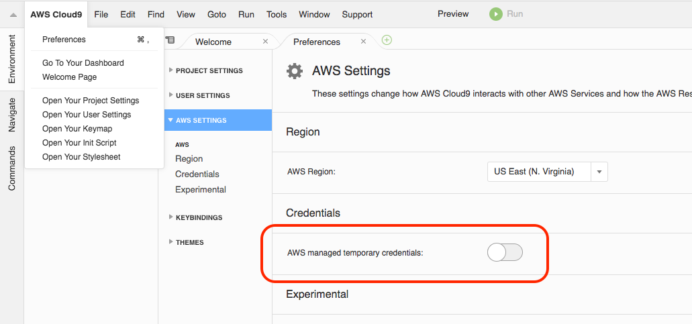

+++
title = "Digital Modernization"
chapter = false
weight = 1
+++

## Getting Started with this Workshop

In order for you to succeed in this workshop, we need you to run through a few steps to finalize the configuration of your Cloud9 environment.

### Update and install some tools.
The first step is to update the `AWS CLI`,`pip` and a range of pre-installed packages.
```
sudo yum update -y && pip install --upgrade --user awscli pip
exec $SHELL
```

### Configure the AWS Environment
After you have the installed the latest `awscli` and `pip` we need to configure
our environment a little
```
aws configure set region us-west-2
```

### AWS Workshop Portal
NOTE: If you are running this workshop using the provided AWS Workshop Portal
environment, following the steps below, if not skip to *Clone the source
repository for this workshop*.

First thing we need to do is update the IAM Instance Profile associated with the
Cloud9 environment.

```
aws ec2 associate-iam-instance-profile \
  --instance-id $(aws ec2 describe-instances \
    --filters Name=tag:Name,Values="*cloud9*" \
    --query Reservations[0].Instances[0].InstanceId \
    --output text) --iam-instance-profile Name="cl9-workshop-role"
```

Following that we'll need to turn off the Managed Temporary credentials.

The Cloud9 IDE needs to use the assigned IAM Instance profile. Open the *AWS
Cloud9* menu, go to *Preferences*, go to *AWS Settings*, and disable *AWS
managed temporary credentials* as depicted in the diagram here:




### Clone the source repository for this workshop.
Now we want to clone the repository that contains all the content and files you need to complete this workshop.
```
cd ~/environment
git clone https://github.com/mandusm/aws-modernization-workshop.git
```

### Installing 3rd Party CLIs
During the workshop we will be using a couple of third party `CLI` tools like `eksctl` to configure our EKS cluster, and `kubectl` to interact with our Kubernetes cluster.

**Step 1**
Let's make a `bin` folder where these binaries will be stored and change our directory to the new location.
```
mkdir ~/bin
cd ~/bin
```

**Step 2**
Download the required `CLI` tools from their locations. Make them Runnable, and add them to our `$PATH`
```
curl -skL "https://github.com/weaveworks/eksctl/releases/download/latest_release/eksctl_$(uname -s)_amd64.tar.gz" | tar xz -C /tmp && mv /tmp/eksctl ~/bin/
curl -skLo ~/bin/kubectl "https://amazon-eks.s3-us-west-2.amazonaws.com/1.10.3/2018-06-05/bin/linux/amd64/kubectl"
curl -skLo ~/bin/heptio-authenticator-aws "https://github.com/kubernetes-sigs/aws-iam-authenticator/releases/download/v0.3.0/heptio-authenticator-aws_0.3.0_linux_amd64"
chmod -R +x ~/bin
echo "export PATH=~/bin:\${PATH}" >> ~/.bashrc
exec $SHELL
```

### Launch an EKS Cluster
It takes a few minutes to launch an EKS cluster, so we will have you launch one now, while completing some initial modules. We will launch our EKS Cluster using the `eksctl` tool

**Step 1**
`eksctl` requires a SSH Key to configure your EKS nodes with.
```
ssh-keygen -t rsa -b 4096 -f ~/.ssh/id_rsa
```

**Step 2**
Now that we have the key, let's launch the EKS Cluster.
```
eksctl create cluster --full-ecr-access --name=petstore
```

**Step 3**
You can expect to see an output like the one below...
```
eksctl create cluster --full-ecr-access --name=petstore
2018-08-27T21:36:50Z [ℹ]  setting availability zones to [us-west-2c us-west-2b us-west-2a]
2018-08-27T21:36:50Z [ℹ]  importing SSH public key "/home/ec2-user/.ssh/eks-key.pub" as "eksctl-petstore-20:bc:c5:14:ab:c1:6b:92:10:e5:92:c0:2a:9e:07:37"
2018-08-27T21:36:50Z [ℹ]  creating EKS cluster "petstore" in "us-west-2" region
2018-08-27T21:36:50Z [ℹ]  creating VPC stack "EKS-petstore-VPC"
2018-08-27T21:36:50Z [ℹ]  creating ServiceRole stack "EKS-petstore-ServiceRole"
2018-08-27T21:37:31Z [✔]  created ServiceRole stack "EKS-petstore-ServiceRole"
2018-08-27T21:37:51Z [✔]  created VPC stack "EKS-petstore-VPC"
2018-08-27T21:37:51Z [ℹ]  creating control plane "petstore"
...
```

We will leave this process running, and get back to it later in the workshop. So let's open a new `terminal` by pressing the combination keys `alt+t`
