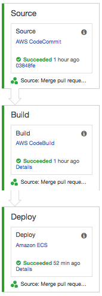
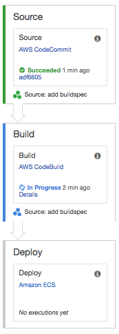
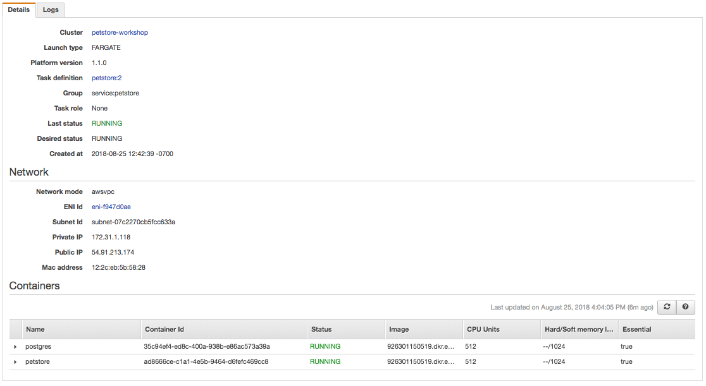

+++
title = "Continuous Integration\Continuous Delivery (CICD)"
chapter = false
weight = 1
+++

## Continuous Integration\Continuous Delivery (CICD)

### Expected Outcome:
* Create a source code repository using AWS CodeCommit
* Configure a CI/CD pipeline using AWS CodePipeline
* Deploy AWS CodeBuild to build your container image and push to ECS

**Lab Requirements:**
* Complete container application and orchestration modules
* Launch Artifactory lab CloudFormation template

**Average Lab Time:** 45-60 minutes


### Introduction
In this lab, we will use https://aws.amazon.com/cloudformation/[AWS CloudFormation] to create our environment and provision various AWS resources. We will use  https://aws.amazon.com/codecommit/[AWS CodeCommit] as our fully managed https://aws.amazon.com/devops/source-control/[source control] service,  https://aws.amazon.com/codepipeline/[AWS CodePipeline] as our https://aws.amazon.com/devops/continuous-integration/[continuous integration] and https://aws.amazon.com/devops/continuous-delivery/[continuous delivery] service, as well as https://aws.amazon.com/codebuild/[AWS CodeBuild] as our fully managed build service. 

It is expected that you have a fully functional JFrog Artifactory installation as well as a source code repository. If you followed the previous _Artifactory_ lab, then these environments are already provisioned in your AWS account. If you have not completed those labs, please do so before continuing with this lab.

In this lab, we will launch a CloudFormation template `pipeline.yaml` in order to automate much of the provisioning and configuring or our pipeline. 

Prerequisites for this template:

* An Existing AWS CodeCommit repository. 
* An Amazon S3 bucket to be used for the output artifacts from AWS CodePipeline. 
* An Artifactory host.
* An exiting Amazon VPC. If you need to build a new one, you can use the https://github.com/aws-quickstart/quickstart-aws-vpc[AWS VPC QuickStart].

### AWS CodePipeline Workflow
A pipeline models our workflow from end to end. Within our pipeline we can have stages, and you can think of stages as groups of actions. An action or a plug in is what acts upon the current revision that is moving through your pipeline; this is where the actual work happens in your pipeline. Stages can then be connected by transitions, and in our console we represent these by an arrow between each stage. Our pipeline will consist of _three_ stages:



The *Source* stage monitors for changes to our source code repository. When a change is made, we will transition to the following stage. In this case, our *Build* stage. Here we will use CodeBuild to build a new docker image and push this to our https://aws.amazon.com/ecr/[Amazon Elastic Container Registry]. This is defined within our _BuildSpec_ which will be found in the `buildspec.yml` in the source code root directory.

```
        BuildSpec: |
          version: 0.2
          phases:
            pre_build:
              commands:
                - echo Logging in to Amazon ECR...
                - aws --version
                - $(aws ecr get-login --region $AWS_DEFAULT_REGION --no-include-email)
                - REPOSITORY_URI=$(aws ecr describe-repositories --repository-name petstore_frontend --query=repositories[0].repositoryUri --output=text)
                - COMMIT_HASH=$(echo $CODEBUILD_RESOLVED_SOURCE_VERSION | cut -c 1-7)
                - IMAGE_TAG=${COMMIT_HASH:=latest}
                - PWD=$(pwd)              
            build:
              commands:
                - echo Build started on `date`
                - echo Building the Docker image...
                - cd modules/containerize-application
                - docker build -t $REPOSITORY_URI:latest .
                - docker tag $REPOSITORY_URI:latest $REPOSITORY_URI:$IMAGE_TAG
            post_build:
              commands:
                - echo Build completed on `date`
                - echo Pushing the Docker images...
                - docker push $REPOSITORY_URI:latest
                - docker push $REPOSITORY_URI:$IMAGE_TAG
                - echo Writing image definitions file...
                - echo Source DIR ${CODEBUILD_SRC_DIR}
                - printf '[{"name":"petstore","imageUri":"%s"}]' $REPOSITORY_URI:$IMAGE_TAG > ${CODEBUILD_SRC_DIR}/imagedefinitions.json
```

Once our new Docker image has successfully been built and stored in ECR, we transition to our final stage where we deploy the image to our Fargate cluster. The *Deploy* stage will then consume the `imagedefinitions.json` output from the _post_build_ process to sping up new containers using our newly created image into our existing cluster.

### Getting Started
Steps to Create the Pipeline

**Step 1:** From your Cloud9 IDE, let's launch the CloudFormation template:
```
aws cloudformation create-stack \
  --stack-name cicd --template-body=file://~/environment/aws-modernization-workshop/modules/cicd/pipeline.yaml \
  --capabilities CAPABILITY_IAM
```

**Step 2:** Wait for the CloudFormation template to successfully deploy.
```
until [[ `aws cloudformation describe-stacks \
  --stack-name "cicd" --query "Stacks[0].[StackStatus]" \
  --output text` == "CREATE_COMPLETE" ]]; \
  do  echo "The stack is NOT in a state of CREATE_COMPLETE at `date`"; \
  sleep 30; done && echo "The Stack is built at `date` - Please proceed"
```

**Step 3:** Obtain the clone URL for our repository. We will pass the output of our CLI query to an ENVIRONMENT VARIABLE for later use.
```
CloneURL=$(aws codecommit get-repository \
  --repository-name aws_pet_store_repo \
  --query 'repositoryMetadata.cloneUrlHttp' \
  --output=text)
```

### Cloning your CodeCommit Repo
**Step 1:** When your Cloud9 environment was provisioned, it should also have automatically cloned the GitHub repository for this lab. We will want to push the contents of that repo to our CodeCommit repo. From your Cloud9 IDE change directories to your locally clone copy of the lab content:
```
cd ~/environment/aws-modernization-workshop/aws-modernization-workshop/
```

**Step 2:** Before we are able to clone our CodeCommit repo, we will need to configure our credentials allow HTTP:
```
git config --global credential.helper '!aws codecommit credential-helper $@'
```

```
git config --global credential.UseHttpPath true
```

**Step 3:** Next, we will add CodeCommit as a remote repo.
```
git remote add codecommit $CloneURL
```

**Step 4:** We are almost ready to commit. Let's configure git with our email and name:
```
git config --global user.email " your_email "
```

```
git config --global user.name " your_name "
```

**Step 5:** Now we are finally ready for our initial commit. Type the following:
```
git status
```

```
git add .
```

```
git commit -am "initial"
```

```
git push -f codecommit master
```

This should create a branch called `master` in your CodeCommit repo and push the contents of our lab. You should see the following results in your Cloud9 console:

```
Counting objects: 457, done.
Compressing objects: 100% (283/283), done.
Writing objects: 100% (457/457), 11.56 MiB | 15.70 MiB/s, done.
Total 457 (delta 153), reused 457 (delta 153)
To https://git-codecommit.us-west-2.amazonaws.com/v1/repos/aws_pet_store_repo
 * [new branch]      master -> master
```

You can also see the same results by navigating to the https://console.aws.amazon.com/codecommit/[CodeCommit console] where you will find results similar to these:


### Build Process
Remember that our pipeline has been configured to watch for any changes to CodeCommit. When a change is detected it will trigger the pipeline and the build process will commence.

You can also trigger the process by clicking the `Release change` button from the https://console.aws.amazon.com/codepipeline/[CodePipeline console]


Once triggered, you should see the various stages go through the workflow from the https://console.aws.amazon.com/codepipeline[CodePipeline console]. For example:



You can also view additional details for the build process by navigating to the https://console.aws.amazon.com/codebuild/[CodeBuild console] where you will find messages for the various stages defined.


A complete log of the events is also detailed for you in this console.


### Deploy Process
The final stage in our pipeline is to deploy the new docker image into our Fargate cluster. As part of the process, an `imagedefinitions.json` file is generated which contains the path to the newly created docker image(s) stored in ECR.

This file will then be used in Fargate's task definition to pull the `latest` image containing your recent code changes.

So, now you should be able to confirm your containers are running by navigating to your https://us-west-2.console.aws.amazon.com/ecs/home?#/clusters/petstore-workshop/services/petstore/details[Fargate console] and see the following:


